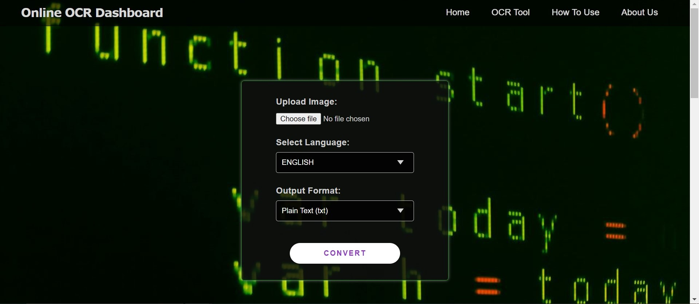

# OCR Dashboard

An Optical Character Recognition (OCR) Dashboard built using **Python**, **FastAPI**, **HTML**, **CSS**, and **EasyOCR**. This project allows users to upload images, extract text using OCR technology, and download the results in various formats.



## Features
- **Image Upload**: Upload images in formats like PNG and JPG.
- **Text Extraction**: Extract text from images using EasyOCR.
- **Multiple Languages Supported**: OCR text extraction available in English, Spanish, French, German, and Italian.
- **Output Formats**: Download the extracted text in DOCX, TXT, or XLSX formats.
- **User-friendly Interface**: Simple and clean UI for easy use.

## Tech Stack
- **Backend**: Python with FastAPI
- **OCR Library**: EasyOCR
- **Frontend**: HTML, CSS (with Milligram CSS framework)
- **Templating**: Jinja2
- **Static Files**: Managed using FastAPI's StaticFiles

## Installation

### Prerequisites
- Python 3.7+
- Pip

### Steps to Install

1. Clone the repository:
    ```bash
    git clone https://github.com/Saqibb786/OCR-Dashboard-in-Python.git
    cd ocr-dashboard
    ```

2. Create and activate a virtual environment (optional but recommended):
    ```bash
    python -m venv venv
    source venv/bin/activate  # On Windows use `venv\Scripts\activate`
    ```

3. Install the required dependencies:
    ```bash
    pip install -r requirements.txt
    ```

4. Run the FastAPI application:
    ```bash
    uvicorn main:app --reload
    ```

5. Open your browser and go to:
    ```
    http://127.0.0.1:8000
    ```

## Usage
1. Upload an image via the **OCR Tool** section on the homepage.
2. Select the language for text extraction.
3. Choose the output format (DOCX, TXT, or XLSX).
4. Click **Convert** to extract text from the image.
5. Download the extracted text by clicking the download button.

## Contributions
If you’d like to contribute, feel free to fork the repository and submit a pull request. You can also open an issue for any bugs or feature requests.

## License
This project is licensed under the MIT License - see the [LICENSE](LICENSE) file for details.
